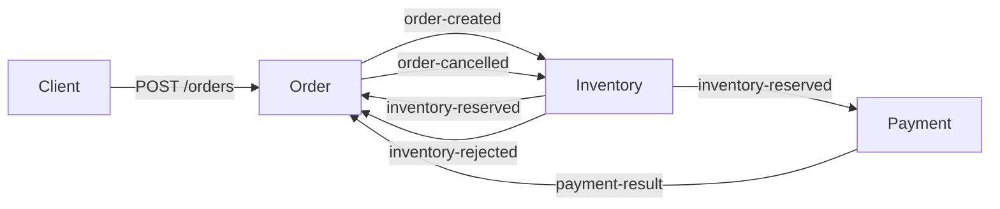

# Distributed Commerce Platform

Java 21, Spring Boot 4.1.1, PostgreSQL 17, Kafka, and a React + TypeScript + Vite frontend. Three services own separate databases and communicate through Kafka choreography. Payment is a simulator; this is a development backend, not a production store.

| Service | HTTP port | PostgreSQL host port | Responsibility |
|---|---:|---:|---|
| Order | 8081 | 5433 | Create/retrieve orders, coordinate lifecycle |
| Inventory | 8082 | 5434 | Reserve/reject stock and compensate payment failures |
| Payment | 8083 | 5435 | Persist deterministic simulated payment decisions |

`integration-tests` is a verification-only Maven module. It starts three independent Spring contexts with three PostgreSQL containers and a Kafka container. It does not add a deployed service or runtime dependency between services.



Every outgoing event is inserted into the owning service's `outbox_events` table in the business transaction. A scheduled relay publishes acknowledged Kafka messages and then marks rows as published. Failures leave the row pending. A crash between Kafka acknowledgement and database commit can deliver a duplicate: delivery is **at least once**, with the original event ID and payload preserved. Consumers use durable per-order outcomes and stock/order locks to make replay safe. Early payment results are persisted in Order's database until its inventory notification arrives.

## Start with Docker

Prerequisites: Docker Engine with Compose v2 or newer. Java, Maven and Node are built inside multi-stage images; no local toolchain is required. Keep ports 5173, 8081–8083, 5433–5435 and 9092 free.

From the repository root:

```bash
docker compose up --build -d
docker compose ps
```

All eight containers start: frontend, Order, Inventory, Payment, three PostgreSQL 17 databases and Kafka 4.1. Startup waits for database/Kafka health before services, and service health before Nginx. The first build downloads dependencies and can take several minutes. Wait until all containers report `healthy` (or run `docker compose up -d --wait --wait-timeout 180` after the build).

```bash
docker compose logs -f order-service inventory-service payment-service
# Stop containers and network while preserving every database and Kafka volume:
docker compose down
# Start again with the same data:
docker compose up --build -d
```

Do not use `docker compose down -v` or delete volumes. Existing volume keys and PostgreSQL credentials are retained. Flyway runs additive migrations on service startup, validates existing schema history and never resets databases. Catalogue V4 and inventory V6 seed missing demo records; restarts preserve quantities, payments, reservations and orders. No `dev` profile is needed.

Open **http://127.0.0.1:5173**. Browse/filter the catalogue, open product details, add products to the persisted bag, and acknowledge the demo checkout before placing an order. The receipt polls real order outcomes; the Order dashboard shows store orders, persisted state transitions, simulated payment results, cancellation reasons and live inventory. It is a shared development dashboard, with no authentication or personal data collection.

The frontend has no fake API or seeded orders. Nginx proxies `/api/products` and `/api/orders` to Order Service, and `/api/inventory` to Inventory Service. See [frontend/README.md](frontend/README.md) for frontend configuration and browser-test instructions.

Order Service's Flyway V4 inserts six deterministic catalogue records with canonical names, descriptions, features and GBP prices. Checkout resolves product names/prices from PostgreSQL and ignores legacy browser-supplied values. Inventory Flyway V6 inserts these fixtures if they do not exist. The optional host `dev` profile also inserts missing fixtures. Restarting does not reset stock or erase reservations:

| Product ID | Initial available stock |
|---|---:|
| `22222222-2222-2222-2222-222222222222` | 100 |
| `33333333-3333-3333-3333-333333333333` | 0 |
| `44444444-4444-4444-4444-444444444444` | 48 |
| `55555555-5555-5555-5555-555555555555` | 24 |
| `66666666-6666-6666-6666-666666666666` | 32 |
| `77777777-7777-7777-7777-777777777777` | 64 |

Check `/actuator/health` on each HTTP port. Create an order:

```bash
curl -i -X POST http://localhost:8081/orders \
  -H 'Content-Type: application/json' \
  -d '{"customerId":"11111111-1111-1111-1111-111111111111","items":[{"productId":"22222222-2222-2222-2222-222222222222","productName":"Mechanical Keyboard","quantity":1,"unitPrice":79.99}]}'
curl http://localhost:8081/orders/<ORDER_ID>
```

POST returns `PENDING`; poll GET until `CONFIRMED`. No actual money is charged.

To demonstrate payment failure deterministically, restart **only Payment** with:

```bash
PAYMENT_SIMULATION_OUTCOME=FAILED docker compose up -d --wait payment-service
```

Submit a new order for the stocked product. It becomes `CANCELLED`, then Inventory restores the reserved quantity. Existing payment decisions remain unchanged. Without a forced outcome, `AUTO` deterministically fails UUIDs whose hash modulo 10 is zero.

To demonstrate inventory rejection, use product `33333333-3333-3333-3333-333333333333` (or an unknown product UUID). Order becomes `CANCELLED`, stock remains unchanged and no payment is requested. Cancellation reasons are persisted in `orders.cancellation_reason` and exposed through `/orders/{id}/details` and the dashboard. The UI disables checkout of known unavailable quantities; stock can still be rejected if availability changes before reservation.

Restore normal simulation with `docker compose up -d --wait payment-service`. To force success use `PAYMENT_SIMULATION_OUTCOME=SUCCEEDED docker compose up -d --wait payment-service`. Outcomes apply only to new payments; existing payment decisions are immutable.

## Configuration

Each application supports normal Spring Boot configuration overrides. Shared environment variables, supplied independently to each process:

- `KAFKA_BOOTSTRAP_SERVERS` (default `localhost:9092`)
- `DB_URL`, `DB_USERNAME`, `DB_PASSWORD` (default to that service's local database)
- Payment: `PAYMENT_SIMULATION_OUTCOME` (`AUTO`, `SUCCEEDED`, `FAILED`)

Custom payment/rejection/cancellation consumer factories read `spring.kafka.bootstrap-servers`; they no longer assume a local broker. Their event types and consumer groups remain distinct. Compose uses its private default bridge network: database DNS names on port 5432 and Kafka at `kafka:19092`. Kafka separately advertises `localhost:9092` to host clients. Nginx strips `/api` and routes orders/products to Order, inventory to Inventory, and the reserved payments API prefix to Payment (Payment currently exposes no public payments endpoint). Unmatched SPA routes serve `index.html`. Browser code uses same-origin relative URLs. These demo credentials and plaintext listeners are intended for local deployment; configure authentication/TLS before public hosting.

Outbox defaults: `outbox.poll-interval-ms=1000`, batches up to 50 individually committed messages, and a 10-second acknowledgement wait per message. `outbox.scheduling-enabled=false` disables automatic publication for deterministic recovery tests; leave it enabled for normal operation. Multiple relays coordinate through PostgreSQL `FOR UPDATE SKIP LOCKED`.

To inspect pending events, connect to the appropriate database and run:

```sql
SELECT event_id, aggregate_id, topic, created_at
FROM outbox_events WHERE published_at IS NULL ORDER BY created_at;
```

Restarting a service resumes pending publication. Published rows are retained for inspection; retention/archiving is not implemented. An old pending event that can never be serialized/published can hold up that relay and requires investigation.

## Troubleshooting

- Build/start failure: `docker compose logs --tail=100` and `docker compose ps -a`. Resolve port conflicts by stopping the process holding a listed port; `FRONTEND_PORT=5174 docker compose up -d frontend` changes the frontend port.
- A database health check passes but the service fails: inspect that service's logs for Flyway validation or credentials errors. Existing PostgreSQL volumes retain their original credentials. Do not reset schema history or erase volumes to fix a migration error.
- Pending orders: check Kafka health and all three service logs, then inspect pending outbox rows using the SQL above. `docker compose restart <service>` resumes publication without resetting data.
- HTTP 502: check backend health and logs. Nginx refreshes Docker DNS every 10 seconds after backend replacement.
- Docker socket permission denied: ensure your account has Docker access or use your system's supported Docker setup.

## Test the deployed stack

With Python 3 installed and the stack healthy in default `AUTO` mode:

```bash
python3 scripts/test-compose.py
```

The script uses the Nginx API proxy and creates real demo orders. It verifies catalogue/stock, successful payments, failed payments with restored inventory, stock rejection, SPA fallback and validation. It preserves existing records and compares stock against its starting values. Avoid concurrent checkouts during the stock assertions. `AUTO` chooses outcomes from order UUIDs; the test submits up to 100 orders to observe both outcomes. Successful test orders consume demo stock.

For a browser journey against the deployed Nginx frontend (requires Node and Playwright Chromium):

```bash
PAYMENT_SIMULATION_OUTCOME=SUCCEEDED docker compose up -d --wait payment-service
npm --prefix frontend ci
cd frontend
npx playwright install chromium
COMMERCE_BASE_URL=http://127.0.0.1:5173 npm run test:e2e
cd ..
docker compose up -d --wait payment-service
```

Browser tests create a real order for two keyboard units and compare stock against its initial quantity. Keep at least two units available and avoid concurrent checkouts. You can use an installed Chrome with `PLAYWRIGHT_CHROMIUM_EXECUTABLE=/path/to/chrome`.

For Java and frontend source tests, install JDK 21/Maven and Node 22.12+ locally:

## Automated verification

```bash
mvn clean verify
npm --prefix frontend run test
npm --prefix frontend run build
```

For the complete real-browser journey, install Chromium once, then run the opt-in browser integration test:

```bash
cd frontend
npx playwright install chromium
cd ..
mvn clean verify -Dcommerce.browser-tests=true
```

On minimal Linux images, Playwright may need its documented system dependencies (`npx playwright install --with-deps chromium`). The browser integration test starts its own PostgreSQL/Kafka containers and all three services on random HTTP ports, sets proxy targets, runs Chromium through Vite on port 5179, and tears everything down. No running developer backend or Compose data is used. Default Maven verification skips only this browser test so Java builds remain independent of Node/Chromium installation.

Docker is required. Tests use isolated PostgreSQL/Kafka containers and do not require Compose or running local services. CI runs this command on pushes and pull requests to `main`.

Tests cover the original domain/API behavior plus three-service success, payment-failure compensation, multi-item stock rejection, missing products, Kafka duplicates, early payment results, conflicting outcomes, transaction rollback, concurrent stock access, failed-publication retry and service restart recovery. Failure injection is explicit: tests simulate a failed Kafka acknowledgement while retaining real PostgreSQL transactions, then recover through the real broker.

## Remaining work

- Real payments, authentication and order ownership; catalogue editing and multi-currency support.
- POST idempotency and broader API policies (current checkout validates identifiers, quantities and catalogue membership).
- Explicit dead-letter handling/replay, compensation acknowledgement, stalled-order reconciliation and legacy-data recovery.
- Reservation completion for fulfilled orders; confirmed orders currently retain reserved stock.
- Multi-broker Kafka, authentication/TLS, metrics and tracing.
- Delivery/contact handling: checkout is intentionally a no-charge demo and collects no personal data.

Flyway migrations are additive. Existing pre-outbox rows are not automatically reconstructed into outgoing events. Pre-V3 Inventory reservations have no recorded line items and cannot be compensated automatically; see [SAGA-COMPENSATION-SETUP.md](SAGA-COMPENSATION-SETUP.md).

## Frontend-facing APIs

| Owner | Endpoint | Behavior |
|---|---|---|
| Order | `GET /products`, `GET /products/{id}` | Authoritative catalogue and GBP prices |
| Order | `POST /orders` | Accepts customer ID and product IDs/quantities; resolves names/prices server-side |
| Order | `GET /orders?customerId=<uuid>&limit=100` | Recent order details, optional customer filter, maximum limit 200 |
| Order | `GET /orders/{id}` | Existing order response |
| Order | `GET /orders/{id}/details` | Order, payment outcome, cancellation reason and persisted transition history |
| Inventory | `GET /inventory` | Current available/reserved quantities by product |

Bad checkout requests return HTTP 400 with a Problem Detail. Unknown catalogue products are rejected before order creation; inventory shortages after submission still use Kafka business rejection. Order history is recorded in the owning PostgreSQL database by an additive Flyway migration/trigger. Legacy orders begin with their known current state; intermediate transitions that never committed are not fabricated. Prices are snapshotted on creation, so existing orders retain their original totals after catalogue edits.
