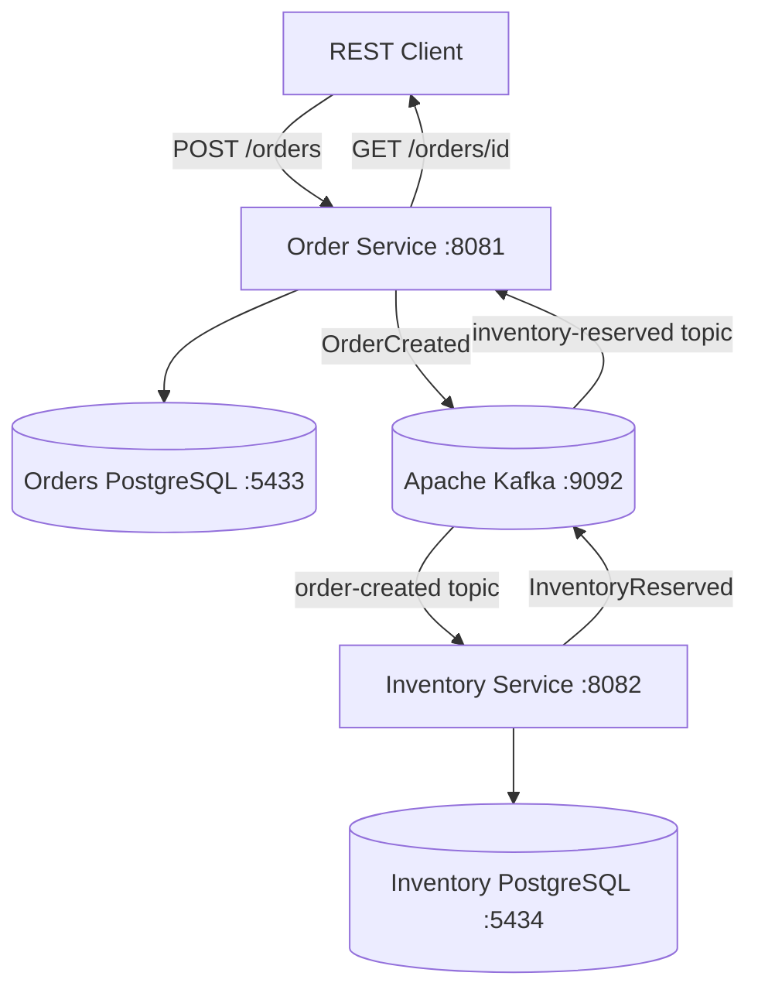

Distributed Commerce Platform
An event-driven commerce backend built with Java 21, Spring Boot 4, Apache Kafka, PostgreSQL, and Docker Compose. This project explores microservice boundaries, asynchronous communication, persistence, and distributed-systems reliability patterns.
> **Project status: In development.** The Order → Inventory → Order event flow has been demonstrated locally. Payment processing, Saga compensation, and production-grade reliability are planned, not yet complete.
Architecture

The services run as separate Spring Boot applications and own their respective data. They communicate through Kafka events rather than calling each other's Java methods. Docker Compose currently runs the supporting infrastructure (two PostgreSQL databases and Kafka); the Spring Boot applications are started locally with Maven.
Services
Service	Port	Responsibility	Database
`order-service`	`8081`	Create and retrieve orders; maintain order lifecycle; publish and consume events	`orders` on `5433`
`inventory-service`	`8082`	Track stock and reserve inventory when an order is created	`inventory` on `5434`
Current event flow
A client sends `POST /orders` to Order Service.
Order Service persists the order with status `PENDING` and publishes an `OrderCreatedEvent` to the `order-created` Kafka topic.
Inventory Service consumes the event, reserves stock in its own PostgreSQL database, and publishes an `InventoryReservedEvent` to the `inventory-reserved` topic.
Order Service consumes the reservation event and changes the persisted order status to `INVENTORY_RESERVED`.
A client can retrieve the updated status through `GET /orders/{orderId}`.
Important: This is an initial working flow, not a complete transaction lifecycle. Duplicate-message handling, reliable database/event coordination, inventory rejection, and compensation are still being developed.
Technology stack
Java 21 and Spring Boot 4.1.1
Spring Web for REST endpoints
Spring Data JPA / Hibernate for persistence
PostgreSQL 17 with Flyway migrations
Apache Kafka for asynchronous events
Maven multi-module build
Docker Compose for local infrastructure
JUnit and Testcontainers for automated testing (coverage is being expanded)
GitHub Actions for CI (`.github/workflows/ci.yml`)
Spring Boot Actuator for health endpoints
Repository structure
```text
distributed-commerce-platform/
├── .github/
│   └── workflows/
│       └── ci.yml
├── order-service/
│   ├── pom.xml
│   └── src/
├── inventory-service/
│   ├── pom.xml
│   └── src/
├── docker-compose.yml
├── pom.xml
└── README.md
```
The root `pom.xml` is the Maven parent/aggregator. Each service has its own dependencies, configuration, application entry point, and persistence code.
Prerequisites
JDK 21
Maven
Docker with Docker Compose
Available local ports: 8081, 8082, 5433, 5434, and 9092
Run locally
From the repository root:
1. Start PostgreSQL and Kafka
```bash
docker compose up -d
docker compose ps
```
Wait for the PostgreSQL containers to become healthy.
2. Build the project
```bash
mvn clean verify
```
> The integration-test setup is still evolving. Some tests may require Docker or additional local infrastructure; a successful build in your environment does not by itself establish that all CI scenarios are independent of local services.
3. Start Order Service (terminal 1)
```bash
mvn -pl order-service spring-boot:run
```
4. Start Inventory Service (terminal 2)
```bash
mvn -pl inventory-service spring-boot:run
```
Check health endpoints:
```bash
curl http://localhost:8081/actuator/health
curl http://localhost:8082/actuator/health
```
5. Create an order (terminal 3)
   The example product UUID below must already exist in the Inventory database with sufficient available quantity for reservation to succeed.
```bash
curl -i -X POST http://localhost:8081/orders \
  -H 'Content-Type: application/json' \
  -d '{
    "customerId": "11111111-1111-1111-1111-111111111111",
    "items": [
      {
        "productId": "22222222-2222-2222-2222-222222222222",
        "productName": "Mechanical Keyboard",
        "quantity": 1,
        "unitPrice": 79.99
      }
    ]
  }'
```
A successful request returns HTTP 201 with an order ID and an initial status of `PENDING`.
6. Retrieve the order
   Replace `<ORDER_ID>` with the `id` returned by the POST request:
```bash
curl http://localhost:8081/orders/<ORDER_ID>
```
After Inventory Service processes the event and Order Service receives the reservation event, the order should show `"status":"INVENTORY_RESERVED"`.
7. Stop infrastructure when finished
   Stop the two Spring Boot applications with `Ctrl+C`, then run:
```bash
docker compose down
```
Avoid `docker compose down -v` unless you intentionally want to delete the databases' persisted volume data.
Testing and CI
Run all Maven module tests and verification steps from the repository root:
```bash
mvn clean verify
```
The GitHub Actions workflow runs on pushes and pull requests targeting `main`. Its build step also uses `mvn --batch-mode clean verify`.
Automated testing is an ongoing focus, particularly for Kafka consumers, event replay, database consistency, and integration tests that can run reliably in CI.
Engineering roadmap
[x] Maven multi-module Spring Boot project
[x] Order Service REST API and PostgreSQL persistence
[x] Inventory Service PostgreSQL persistence and stock reservation
[x] Kafka `order-created` event consumption
[x] Kafka `inventory-reserved` event consumption and order status update
[x] Docker Compose infrastructure
[x] Initial automated tests and GitHub Actions CI workflow
[ ] Robust idempotency and duplicate-event protection
[ ] Explicit stock-unavailable handling and failure events
[ ] Payment Service and payment result events
[ ] End-to-end Saga flow with compensating actions
[ ] Transactional outbox and reliable event publication
[ ] Expanded Testcontainers-based integration tests
[ ] Observability, metrics, tracing, and operational dashboards
[ ] Containerized services and deployment documentation
Design principles
Service ownership: each microservice owns its business rules and data.
Event-driven communication: Kafka topics decouple producers from consumers.
Domain modeling: order and inventory behavior is expressed in domain objects rather than only controllers.
Schema versioning: Flyway manages database evolution.
Incremental reliability: the project will add idempotency, failure handling, and consistency patterns as the workflow grows.
License
No license has been specified yet. Add a `LICENSE` file if you want to define reuse permissions for others.